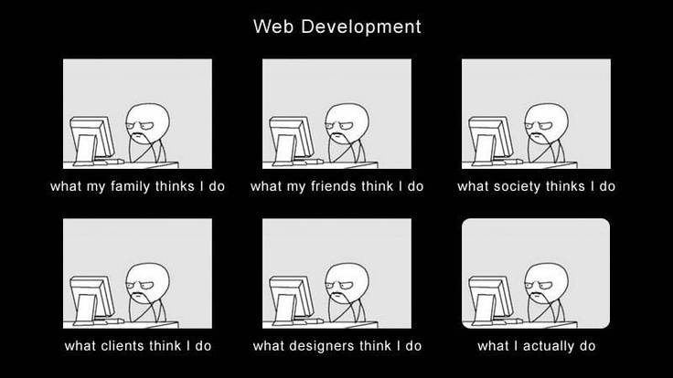
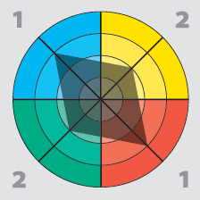
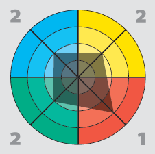

# Ildiko Toth README

This document is aimed to help you understand how to interface with me as a human

Feel free to approach me and have a chat if you'd like something clarified or answered. Headphones mean I'm either elbows-deep in focus and would rather be left alone to work a problem out or that I'm taking a break from the hum of the office. Still, don't be intimidated by them, they don't mean I'm under no circumstances to be disturbed!

## Personal Information 
I've been with AND since 2017 as a Product Developer and Problem Solver, but I spent a while of that on maternity leave with my daughter. Between my son who now goes to nursery and my daughter, who isn't even one yet, there's always something to do. When not spending time with them and my husband, my life revolves around technology and communities. I've been involved with online forums since I first connected to the Internet. I love exchanging new ideas and passing on my own to help others.

## What I Do

I'm a developer most proficient in PHP, JS, ReactJS, HTML, SASS. Mostly involved with frontend but I love to work on middleware as well. There are some areas, like NodeJS, Jenkins or Docker where I still need to improve my skills, which is exactly what I’m going to do.

Having gathered 10 years of experience in software development I try to focus nowadays on an architectural viewpoint. The satisfaction of seeing products leave my hands is what makes me move forward.

## How I work

Like a lightning storm. In a lightning potential energy builds up until the electrons find an optimally short path between the two poles, at which moment tremendous energy flows from one point to the other. In a sense I'm like that. I like tickets, plans, designs and details to be in order before it's my time to put them all together, but then I go deep into focus and won't let go until everything is solved. I like order and method to be parts of my problem solving style. While I can and often do work under suboptimal conditions, the greatest pleasure work gives me comes from knowing where to aim and taking material steps to get there the shortest way possible.

 - I'm a night owl, you won't often find me asleep before 2 in the morning.
 - Therefore I prefer to work between 10am-6pm
 - Coffee is important, but I don't have more than one or two cups a day. Even then, those are strategically placed to coincide with breakfast or afternoon tea.
 - I like plans. The more in-depth the details the happier they make me. Otherwise you'll get what I think you wanted, which may or may not be what you thought you'd wanted. 
 - I like deep focus. Sometimes I'll forget to eat or drink or even move when working on a hard problem.
 - Headphones aren't my shield. Feel free to approach. They usually mean I'm drowning out some of the noise to help me concentrate.
 
## What makes me stressed out

Feature creep gets my stress levels moving, but material changes to a project halfway through really irk me. As long as there's a concise, clear plan I'll be happy to hunker down. Lack of vision and leadership make me want to take the reigns and I don't particularly like doing that!

## Feedback

 Face to face feedback works best. It's most personal, there's the least chance of misunderstanding. I'd rather still be sent a message than not let known at all. Any feedback is good feedback as long as I can do something about it, so don't keep any of the constructive ones to yourselves!

## HBDI

1212, blue red dominant. I'm methodical, logical and if left to my own devices I'll follow a clearly laid out plan. Happy to work as part of an efficient group. I will debate you and bring logical arguments to aid me, if I feel that there's benefit to my way of doing things. But I'm not opposed to compromise either if I think that's what gets us the most beneficial results the quickest. Think a watered-down Mr. Spock but heaps less annoying.

Under stress I become very red. Mostly on the HBDI scale, but a little in the face, too. 

## Aspirations

My main goals are to get more proficient with great  and clean software architectures. Family are important but so is not staying in one place with new tech. That said, I'd like 2019 to be more about depth rather than width when it comes to frameworks and technologies.
